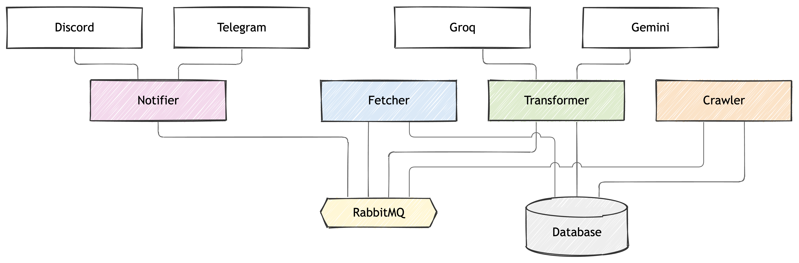

# smartnews

## Introduction

### Goal

`smartnews` watches a configurable list of RSS/Atom feeds — engineering
blogs, release notes, AI news, markets, world news, and more — and pushes
only the new, relevant articles to a Discord and/or Telegram channel, with
an optional LLM pass that translates and summarizes each article before it
is sent.

### The problem

Keeping up with dozens of feeds by hand doesn't scale:

- Checking every source manually is slow and easy to fall behind on.
- Plain RSS readers show everything, including articles you've already
  seen across multiple runs or devices.
- Titles and summaries are often verbose, in English only, and not
  tailored to what you actually want to skim.

### The solution

`smartnews` automates the whole loop:

1. **Fetch** every enabled source's feed.
2. **Deduplicate** against a Postgres-backed store, so the same article is
   never sent twice on the same channel, even across separate runs.
3. **Filter/translate** each surviving article with an LLM (Gemini or
   Groq), rewriting the title/summary into a short, Vietnamese-language
   overview while keeping technical terms untouched.
4. **Notify** the configured channel(s) — Discord and/or Telegram — with
   the final result.

Each stage is isolated: a fetch failure on one source, a translation
failure on one article, or a send failure on one notifier only affects
that item, never the rest of the run.

## How it works



```
                       ┌──► [articles.fetched] ──► transformer ──► [articles.transformed] ──► notifier
fetcher ──► (fan-out) ─┤
                       └──► [articles.crawl] ──► crawler ──► [articles.crawled]
```

1. **fetcher** fetches every enabled feed once a day at a fixed local time,
   drops stale articles, stores new ones in Postgres and publishes them.
   RabbitMQ fans each message out to the transformer and the crawler.
2. **transformer** translates each article's title and summary to
   Vietnamese with Gemini or Groq and stores the result. It also translates
   the full content the crawler extracts. Each step has its own provider
   and model.
3. **notifier** posts each article to Discord and/or Telegram and
   records which channels received it, so nothing is posted twice.
4. **crawler** downloads each article's page, extracts the main text and
   stores it. It runs independently, so a site it cannot fetch never delays
   delivery. Nothing consumes `articles.crawled` yet, so that queue grows
   until a consumer exists or a retention policy is set in RabbitMQ.

Failed steps are retried after 1, 5 and 15 minutes, then parked in a
dead-letter queue visible in the RabbitMQ UI (http://localhost:15672).

## Usage

### Requirements

- Docker with Compose
- For development: [uv](https://docs.astral.sh/uv/) and [sqlc](https://sqlc.dev/)

### Configuration

- `config/fetcher.yaml` — `run_at`/`timezone` and the source list.
- `config/transformer.yaml` — for the `summary` and `content` steps: on/off, provider, model.
- `config/notifier.yaml` — which channels are enabled.
- `config/crawler.yaml` — request timeout, user agent and per-source content selectors.
- Secrets: copy `services/transformer/.env.example` and
  `services/notifier/.env.example` to `.env` next to them and fill in
  the keys for what you enabled.

### Running

```bash
docker compose up -d --build
docker compose logs -f fetcher transformer notifier crawler
```

Migrations run automatically before the services start.

### Development

```bash
uv run pytest       # run the test suite
uv run ruff check    # lint
```
